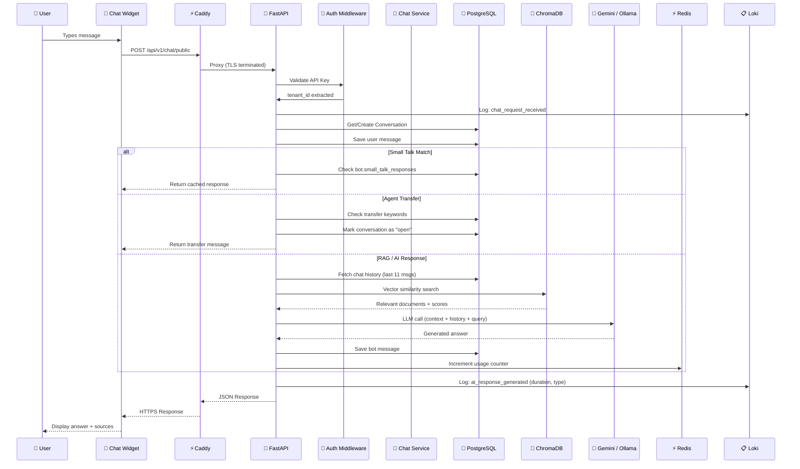
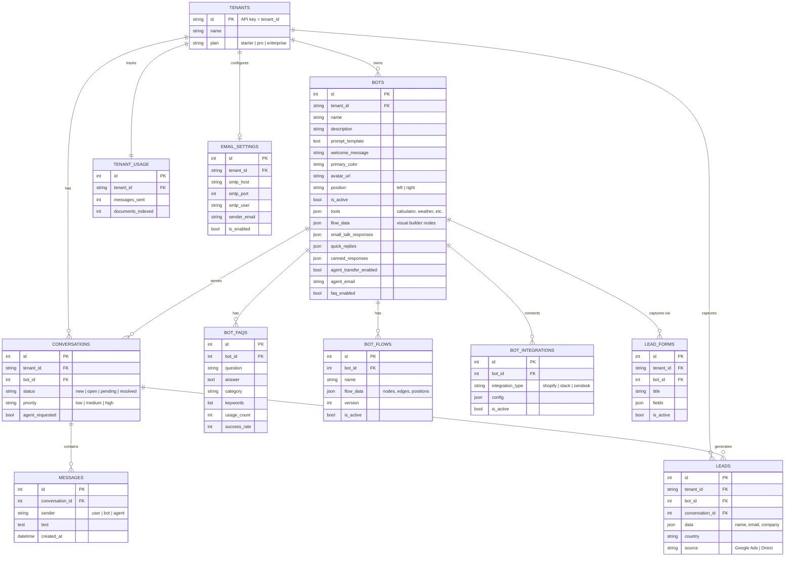
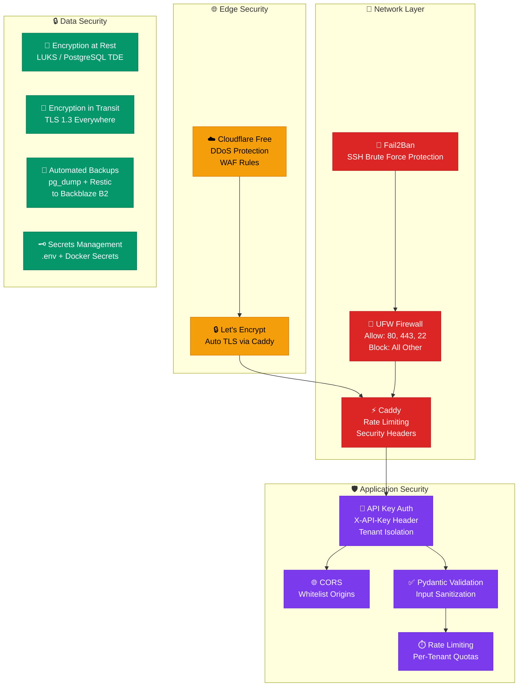

# TangentCloud AI Bots — Self-Hosted VPS Architecture (Open-Source Only)

## 1. Full System Architecture

```mermaid
graph TB
    subgraph INTERNET["🌐 Internet"]
        U1["👤 End Users<br/>(Chat Widget)"]
        U2["👩‍💼 Dashboard Users<br/>(Admin/Tenant)"]
        U3["📱 Mobile Users<br/>(Expo App)"]
        DNS["🔗 DNS Provider<br/>Cloudflare Free / Namecheap"]
    end

    subgraph VPS["🖥️ Self-Hosted VPS (Ubuntu 22.04 LTS)"]
        subgraph PROXY["🔒 Reverse Proxy Layer"]
            CADDY["⚡ Caddy v2<br/>Auto SSL (Let's Encrypt)<br/>:80 / :443"]
        end

        subgraph APP["🐳 Docker Compose — Application Stack"]
            subgraph FRONTEND["📦 Frontend Containers"]
                DASH["💻 Dashboard<br/>Next.js 15 (SSR)<br/>:9101"]
                WIDGET["🔌 Chat Widget<br/>Embeddable JS<br/>(served via Dashboard)"]
            end

            subgraph BACKEND["📦 Backend Container"]
                API["🚀 FastAPI<br/>Uvicorn (ASGI)<br/>:9100"]

                subgraph ROUTES["API Routers"]
                    R_CHAT["/api/v1/chat"]
                    R_DASH["/api/v1/dashboard"]
                    R_INGEST["/api/v1/ingest"]
                    R_LEADS["/api/v1/leads"]
                    R_ANALYTICS["/api/v1/analytics"]
                    R_FLOWS["/api/v1/flows"]
                    R_BILLING["/api/v1/billing"]
                end

                subgraph MIDDLEWARE["Middleware"]
                    MW_CORS["CORS"]
                    MW_LOG["Request Logger<br/>(JSON → Loki)"]
                    MW_AUTH["API Key Auth<br/>(Tenant Isolation)"]
                end

                subgraph SERVICES["Core Services"]
                    SVC_RAG["🧠 RAG Service<br/>LangChain + ChromaDB"]
                    SVC_AGENT["🤖 Agent Service<br/>Tool Calling<br/>(Calculator, Weather)"]
                    SVC_EMAIL["📧 Email Service<br/>SMTP"]
                    SVC_BILLING["💳 Billing Service<br/>Stripe Webhooks"]
                end
            end

            subgraph MOBILE["📦 Mobile Container"]
                EXPO["📱 Expo Dev Server<br/>React Native<br/>:9102"]
            end
        end

        subgraph DATA["🐳 Docker Compose — Data Layer"]
            subgraph DB_LAYER["Persistent Storage"]
                POSTGRES["🐘 PostgreSQL 16<br/>(Production DB)<br/>:5432"]
                REDIS["⚡ Redis 7 Alpine<br/>(Cache + Queues)<br/>:6379"]
                CHROMA["🔮 ChromaDB<br/>(Vector Embeddings)<br/>:8000"]
            end
        end

        subgraph MONITORING["🐳 Docker Compose — Observability Stack"]
            LOKI["📋 Grafana Loki 3.0<br/>(Log Aggregation)<br/>:3100"]
            PROMTAIL["📡 Promtail<br/>(Log Shipper)"]
            PROM["📊 Prometheus<br/>(Metrics Scraping)<br/>:9090"]
            GRAFANA["📈 Grafana 11<br/>(Dashboards & Alerts)<br/>:3001"]
            OTEL["🔭 OpenTelemetry<br/>Collector<br/>:4317"]
        end

        subgraph STORAGE["💾 Host Volumes"]
            VOL_DB[("postgres_data")]
            VOL_REDIS[("redis_data")]
            VOL_CHROMA[("chroma_data")]
            VOL_LOKI[("loki_data")]
            VOL_GRAFANA[("grafana_data")]
            VOL_BACKUP[("backup_data")]
        end
    end

    subgraph EXTERNAL["☁️ External APIs (Optional)"]
        GEMINI["🤖 Google Gemini API<br/>gemini-2.0-flash<br/>gemini-embedding-001"]
        OLLAMA["🦙 Ollama (Self-Hosted)<br/>llama3, mistral, etc."]
        STRIPE["💳 Stripe API<br/>(Payments)"]
        SMTP_EXT["📧 SMTP Server<br/>(Mailgun / Postmark)"]
    end

    %% ─── User Flows ───
    U1 -->|"HTTPS"| DNS
    U2 -->|"HTTPS"| DNS
    U3 -->|"HTTPS"| DNS
    DNS -->|"A Record"| CADDY

    %% ─── Caddy Routing ───
    CADDY -->|"app.yourdomain.com"| DASH
    CADDY -->|"api.yourdomain.com"| API
    CADDY -->|"grafana.yourdomain.com"| GRAFANA

    %% ─── Frontend → Backend ───
    DASH -->|"REST API"| API
    WIDGET -->|"REST API"| API
    EXPO -->|"REST API"| API

    %% ─── API Internal ───
    R_CHAT --> SVC_RAG
    R_CHAT --> SVC_AGENT
    R_INGEST --> SVC_RAG
    R_LEADS --> SVC_EMAIL
    R_BILLING --> SVC_BILLING

    %% ─── Services → Data ───
    API -->|"SQLAlchemy ORM"| POSTGRES
    API -->|"Session Cache"| REDIS
    SVC_RAG -->|"Vector Search"| CHROMA
    SVC_RAG -->|"LLM + Embeddings"| GEMINI
    SVC_RAG -.->|"Alt: Local LLM"| OLLAMA
    SVC_AGENT -->|"LLM"| GEMINI
    SVC_BILLING -->|"Webhooks"| STRIPE
    SVC_EMAIL -->|"SMTP"| SMTP_EXT

    %% ─── Observability ───
    API -->|"OTLP gRPC"| OTEL
    OTEL --> LOKI
    OTEL --> PROM
    PROMTAIL -->|"Scrape Containers"| LOKI
    PROM --> GRAFANA
    LOKI --> GRAFANA

    %% ─── Volumes ───
    POSTGRES --- VOL_DB
    REDIS --- VOL_REDIS
    CHROMA --- VOL_CHROMA
    LOKI --- VOL_LOKI
    GRAFANA --- VOL_GRAFANA

    %% ─── Styling ───
    classDef proxy fill:#1e40af,stroke:#1e3a5f,color:#fff
    classDef frontend fill:#059669,stroke:#047857,color:#fff
    classDef backend fill:#7c3aed,stroke:#6d28d9,color:#fff
    classDef data fill:#dc2626,stroke:#b91c1c,color:#fff
    classDef monitoring fill:#f59e0b,stroke:#d97706,color:#000
    classDef external fill:#6b7280,stroke:#4b5563,color:#fff
    classDef volume fill:#374151,stroke:#1f2937,color:#fff

    class CADDY proxy
    class DASH,WIDGET,EXPO frontend
    class API,R_CHAT,R_DASH,R_INGEST,R_LEADS,R_ANALYTICS,R_FLOWS,R_BILLING backend
    class SVC_RAG,SVC_AGENT,SVC_EMAIL,SVC_BILLING backend
    class POSTGRES,REDIS,CHROMA data
    class LOKI,PROMTAIL,PROM,GRAFANA,OTEL monitoring
    class GEMINI,OLLAMA,STRIPE,SMTP_EXT external
    class VOL_DB,VOL_REDIS,VOL_CHROMA,VOL_LOKI,VOL_GRAFANA,VOL_BACKUP volume
```

---

## 2. Request Flow — Chat Message Lifecycle

---

## 3. Data Model — Entity Relationship

---

## 4. Deployment Pipeline — CI/CD (Open-Source)

```mermaid
flowchart LR
    subgraph DEV["💻 Developer Machine"]
        CODE["📝 Code Changes"]
        TEST["🧪 pytest (29 tests)"]
    end

    subgraph GIT["📦 Git Repository"]
        GITEA["Gitea / Forgejo<br/>(Self-Hosted Git)"]
    end

    subgraph CI["⚙️ CI/CD Pipeline"]
        DRONE["🚁 Drone CI / Woodpecker<br/>(Self-Hosted)"]
        LINT["🔍 Lint + Type Check"]
        UNIT["🧪 Unit Tests"]
        BUILD["🐳 Docker Build"]
        PUSH["📤 Push to Registry"]
    end

    subgraph REGISTRY["📦 Container Registry"]
        REG["🐳 Docker Registry<br/>(Self-Hosted :5000)"]
    end

    subgraph DEPLOY["🖥️ VPS Deployment"]
        PULL["📥 Docker Pull"]
        COMPOSE["🐳 docker compose up -d"]
        HEALTH["❤️ Health Checks"]
        ROLLBACK["⏪ Auto-Rollback"]
    end

    CODE -->|"git push"| GITEA
    GITEA -->|"webhook"| DRONE
    DRONE --> LINT --> UNIT --> BUILD --> PUSH
    PUSH --> REG
    REG --> PULL --> COMPOSE --> HEALTH
    HEALTH -->|"fail"| ROLLBACK
    TEST -.->|"local"| CODE

    classDef dev fill:#059669,stroke:#047857,color:#fff
    classDef git fill:#f59e0b,stroke:#d97706,color:#000
    classDef ci fill:#7c3aed,stroke:#6d28d9,color:#fff
    classDef deploy fill:#1e40af,stroke:#1e3a5f,color:#fff

    class CODE,TEST dev
    class GITEA git
    class DRONE,LINT,UNIT,BUILD,PUSH ci
    class REG git
    class PULL,COMPOSE,HEALTH,ROLLBACK deploy
```

---

## 5. Security Architecture

---

## 6. Technology Stack Summary

| Layer | Technology | License | Port |
|---|---|---|---|
| **Reverse Proxy** | Caddy v2 | Apache 2.0 | 80/443 |
| **Frontend** | Next.js 15 | MIT | 9101 |
| **Backend** | FastAPI + Uvicorn | MIT/BSD | 9100 |
| **Mobile** | React Native + Expo | MIT | 9102 |
| **Database** | PostgreSQL 16 | PostgreSQL | 5432 |
| **Cache/Queue** | Redis 7 | BSD | 6379 |
| **Vector DB** | ChromaDB | Apache 2.0 | 8000 |
| **LLM (Cloud)** | Google Gemini API | Proprietary* | — |
| **LLM (Self-Hosted)** | Ollama + Llama3 | MIT | 11434 |
| **Embeddings** | gemini-embedding-001 | Proprietary* | — |
| **Embeddings (Alt)** | Ollama + nomic-embed | Apache 2.0 | 11434 |
| **ORM** | SQLAlchemy 2.0 | MIT | — |
| **AI Framework** | LangChain | MIT | — |
| **Logs** | Grafana Loki 3.0 | AGPL 3.0 | 3100 |
| **Log Shipper** | Promtail | AGPL 3.0 | — |
| **Metrics** | Prometheus | Apache 2.0 | 9090 |
| **Dashboards** | Grafana 11 | AGPL 3.0 | 3001 |
| **Tracing** | OpenTelemetry | Apache 2.0 | 4317 |
| **Containers** | Docker + Compose | Apache 2.0 | — |
| **CI/CD** | Drone CI / Woodpecker | Apache 2.0 | 8080 |
| **Git** | Gitea / Forgejo | MIT | 3000 |
| **SSL** | Let's Encrypt (Caddy) | MPL 2.0 | — |
| **Backup** | Restic + pg_dump | BSD | — |
| **Firewall** | UFW + Fail2Ban | GPL | — |

> *\* Gemini API is free-tier eligible. For fully open-source LLM, swap to Ollama with Llama3/Mistral.*

---

## 7. VPS Minimum Requirements

| Spec | Minimum | Recommended |
|---|---|---|
| **CPU** | 2 vCPU | 4 vCPU |
| **RAM** | 4 GB | 8 GB (16 GB with Ollama) |
| **Storage** | 40 GB SSD | 100 GB NVMe |
| **OS** | Ubuntu 22.04 LTS | Ubuntu 24.04 LTS |
| **Bandwidth** | 1 TB/mo | Unmetered |
| **Cost** | ~$10/mo (Hetzner) | ~$20/mo (Hetzner) |

### Recommended VPS Providers (Budget-Friendly)
- **Hetzner** — €4.15/mo (CX22: 2vCPU, 4GB, 40GB)
- **Contabo** — $6.99/mo (VPS S: 4vCPU, 8GB, 200GB)
- **Netcup** — €3.99/mo (VPS 1000: 2vCPU, 8GB, 128GB)
- **Oracle Cloud** — Free tier (4 ARM cores, 24GB RAM)
